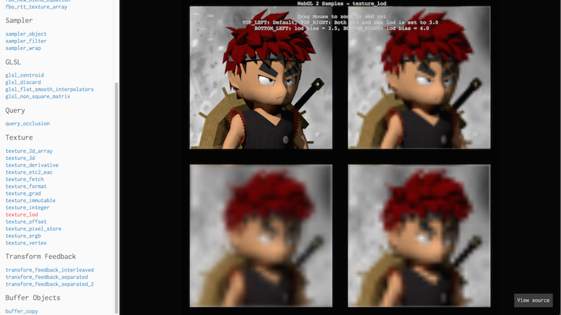
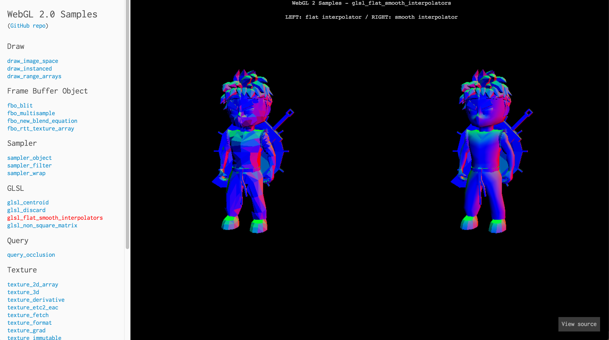
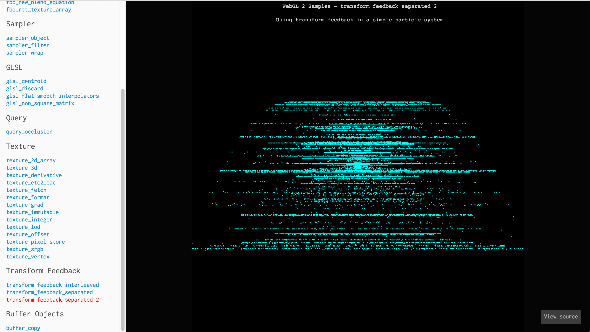

WebGL 2 Samples Pack
=====================

[](https://travis-ci.org/WebGLSamples/WebGL2Samples)
[](https://github.com/WebGLSamples/WebGL2Samples/blob/master/LICENSE.md)

Run the live **[WebGL 2 Samples Pack](http://webglsamples.org/WebGL2Samples/)**.

Short and easy to understand samples demonstrating WebGL 2 features by [Shuai Shao (Shrek)](https://shrekshao.github.io) and [Trung Le](http://www.trungtuanle.com/). Advised by [Patrick Cozzi](http://www.seas.upenn.edu/~pcozzi/), University of Pennsylvania.

Inspired by and ported from Christophe Riccio's ([@Groovounet](https://github.com/Groovounet)) [OpenGL Samples Pack](https://github.com/g-truc/ogl-samples).

## Screenshots

| [Texture LOD](http://webglsamples.org/WebGL2Samples/#texture_lod) | [Flat/smooth interpolation](http://webglsamples.org/WebGL2Samples/#glsl_flat_smooth_interpolators) |
| --- | ----|
|[](http://webglsamples.org/WebGL2Samples/#texture_lod) | [](http://webglsamples.org/WebGL2Samples/#glsl_flat_smooth_interpolators)|

| [Sampler object wrap](http://webglsamples.org/WebGL2Samples/#sampler_wrap) | [Transform feedback](http://webglsamples.org/WebGL2Samples/#transform_feedback_separated_2) |
| --- | ----|
|[](http://webglsamples.org/WebGL2Samples/#sampler_wrap) | [](http://webglsamples.org/WebGL2Samples/#transform_feedback_separated_2)|

## Samples Compatibility

:warning: the [minial-gltf-loader](https://github.com/shrekshao/minimal-gltf-loader) used for samples is in development and contributions are welcome.

:grey_exclamation: Compatibility table updated on 2016/12/29

|              | Chrome Canary 57 Windows 10| Chrome Canary 58 OSX 10| Firefox Nightly 53 Windows 10| Firefox Developer Edition 52 OSX 10|
|--------------|:-----------------:|:--------------------------------------:|:-----------------:|:-----------------------:|
|[draw_image_space](http://webglsamples.org/WebGL2Samples/#draw_image_space)|:white_check_mark:|:white_check_mark:|:white_check_mark:|:white_check_mark:|
|[draw_instanced](http://webglsamples.org/WebGL2Samples/#draw_instanced)|:white_check_mark: |:white_check_mark:| :white_check_mark:|:white_check_mark:|
|[draw_primitive_restart](http://webglsamples.org/WebGL2Samples/#draw_primitive_restart)|:white_check_mark:|:white_check_mark:|:x:drawElements: bound vertex attribute buffers do not have sufficient size for given indices from the bound element array|:white_check_mark:|
|[draw_range_arrays](http://webglsamples.org/WebGL2Samples/#draw_range_arrays)|:white_check_mark: | :white_check_mark:|:white_check_mark:|:white_check_mark:|
|[glsl_centroid](http://webglsamples.org/WebGL2Samples/#glsl_centroid)|:white_check_mark: |:white_check_mark: | :white_check_mark:|:white_check_mark:|
|[glsl_discard](http://webglsamples.org/WebGL2Samples/#glsl_discard)|:white_check_mark: |:white_check_mark:| :white_check_mark:|:white_check_mark:|
|[glsl_flat_smooth_interpolators](http://webglsamples.org/WebGL2Samples/#glsl_flat_smooth_interpolators)|:white_check_mark: |:white_check_mark:| :white_check_mark: |:white_check_mark:|
|[glsl_non_square_matrix](http://webglsamples.org/WebGL2Samples/#glsl_non_square_matrix)|:white_check_mark: |:white_check_mark:| :white_check_mark: |:white_check_mark:|
|[query_occlusion](http://webglsamples.org/WebGL2Samples/#query_occlusion)|:white_check_mark:|:white_check_mark:| :white_check_mark:|:white_check_mark:|
|[sampler_object](http://webglsamples.org/WebGL2Samples/#sampler_filter)|:white_check_mark:|:white_check_mark:| :white_check_mark:|:white_check_mark:|
|[sampler_wrap](http://webglsamples.org/WebGL2Samples/#sampler_filter)|:white_check_mark:|:white_check_mark:| :white_check_mark:|:white_check_mark:|
|[sampler_filter](http://webglsamples.org/WebGL2Samples/#sampler_filter)|:white_check_mark:|:white_check_mark:|:white_check_mark:|:white_check_mark:|
|[texture_derivative](http://webglsamples.org/WebGL2Samples/#texture_derivative)|:white_check_mark:|:white_check_mark:|:white_check_mark:|:white_check_mark:|
|[texture_2d_array](http://webglsamples.org/WebGL2Samples/#texture_2d_array)|:white_check_mark:|:white_check_mark:|:white_check_mark:|:white_check_mark:|
|[texture_etc2_eac](http://webglsamples.org/WebGL2Samples/#texture_etc2_eac)|:x: compressedTexImage2D: invalid format|TODO|:x: compressedTexImage2D: Invalid internalFormat: 0x9278 |:x: not working|
|[texture_format](http://webglsamples.org/WebGL2Samples/#texture_format)|:white_check_mark:|:white_check_mark:|:white_check_mark:|:white_check_mark:|
|[texture_fetch](http://webglsamples.org/WebGL2Samples/#texture_fetch)|:white_check_mark:|:white_check_mark:|:white_check_mark:|:white_check_mark:|
|[texture_grad](http://webglsamples.org/WebGL2Samples/#texture_grad)|:white_check_mark:|:white_check_mark:|:white_check_mark:|:white_check_mark:|
|[texture_3d](http://webglsamples.org/WebGL2Samples/#texture_3d)|:white_check_mark:|:white_check_mark:|:white_check_mark:|:white_check_mark:|
|[texture_immutable](http://webglsamples.org/WebGL2Samples/#texture_immutable)|:white_check_mark:|:white_check_mark:|:white_check_mark:|:white_check_mark:|
|[texture_integer](http://webglsamples.org/WebGL2Samples/#texture_integer)|:white_check_mark:|:white_check_mark:|:white_check_mark:|:white_check_mark:|
|[texture_lod](http://webglsamples.org/WebGL2Samples/#texture_lod)|:white_check_mark:|:white_check_mark:|:white_check_mark:|:white_check_mark:|
|[texture_offset](http://webglsamples.org/WebGL2Samples/#texture_offset)|:white_check_mark:|:white_check_mark:|:white_check_mark:|:white_check_mark:|
|[texture_pixel_store](http://webglsamples.org/WebGL2Samples/#texture_pixel_store)|:white_check_mark:|:white_check_mark:|:white_check_mark:|:white_check_mark:|
|[texture_srgb](http://webglsamples.org/WebGL2Samples/#texture_srgb)|:white_check_mark:|:white_check_mark:|:white_check_mark:|:white_check_mark:|
|[texture_vertex](http://webglsamples.org/WebGL2Samples/#texture_vertex)|:white_check_mark:|:white_check_mark:|:white_check_mark:|:white_check_mark:|
|[transform_feedback_interleaved](http://webglsamples.org/WebGL2Samples/#transform_feedback_interleaved)|:white_check_mark:|:white_check_mark:|:white_check_mark:|:white_check_mark:|
|[transform_feedback_separated](http://webglsamples.org/WebGL2Samples/#transform_feedback_separated)|:white_check_mark:|:white_check_mark:|:white_check_mark:|:white_check_mark:|
|[transform_feedback_separated_2](http://webglsamples.org/WebGL2Samples/#transform_feedback_separated_2)|:white_check_mark:|:white_check_mark:|:white_check_mark:|:white_check_mark:|
|[fbo_rtt_texture_array](http://webglsamples.org/WebGL2Samples/#fbo_rtt_texture_array)|:white_check_mark:|:white_check_mark:|:white_check_mark:|:white_check_mark:|
|[fbo_blit](http://webglsamples.org/WebGL2Samples/#fbo_blit)|:white_check_mark:|:white_check_mark:|:white_check_mark:|:white_check_mark:|
|[fbo_multisample](http://webglsamples.org/WebGL2Samples/#fbo_multisample)|:white_check_mark:|:white_check_mark:|:white_check_mark:|:white_check_mark:|
|[fbo_new_blend_equation](http://webglsamples.org/WebGL2Samples/#fbo_new_blend_equation)|:white_check_mark:|:white_check_mark:|:white_check_mark:|:white_check_mark:|
|[buffer_copy](http://webglsamples.org/WebGL2Samples/#buffer_copy)|:white_check_mark:|:white_check_mark:|:white_check_mark:|:white_check_mark:|
|[buffer_uniform](http://webglsamples.org/WebGL2Samples/#buffer_uniform)|:white_check_mark:|:white_check_mark:|:white_check_mark:|:white_check_mark:|
|[geo_texture_format](http://webglsamples.org/WebGL2Samples/#geo_texture_format)|:white_check_mark:|:white_check_mark:|:white_check_mark:|:white_check_mark:|


## Running the Samples Locally

Clone this repo:
```
git@github.com:WebGLSamples/WebGL2Samples.git
```

Then run a local web server from the repo's root directory.  for example, if you have [Python](https://www.python.org/) installed, run
```
cd WebGL2Samples
python -m SimpleHTTPServer
```
Then browse to
```
http://localhost:8000/
```

### Build Instructions

The samples do not require a build; however, Node.js and gulp can be used to run JSHint to aid in development.

Install [Node.js](http://nodejs.org/).  From the root directory of this repo, run:
```
npm install
```
To run JSHint on the entire codebase, run
```
npm run jsHint
```
To run JSHint automatically when a file is saved, run the following and leave it open in a console window:
```
npm run jsHint-watch
```

## Contributions

This is a community project.  We welcome contributions!  Check out the [issues](https://github.com/WebGLSamples/WebGL2Samples/issues) for ideas on what to contribute.

When you open a pull request, please make sure that GitHub reports that "All checks have passed", indicated by the white checkmark in a green circle on top of the "Merge pull request" button.  Travis CI is used to run JSHint on your branch, and [CLA assistant](https://cla-assistant.io/) is used for signing a Contributor License Agreement (CLA).  Submit an [issue](https://github.com/WebGLSamples/WebGL2Samples/issues) if you have any questions.

## About WebGL Resource Deletion

WebGL applications should, in general, use the delete* APIs to manage their resources (buffers, textures, etc.) rather than relying on the browser's garbage collector to reclaim them. Note that many of the samples here do not delete their resources explicitly; this is the case because they would only be reclaimed upon page unload, and it's neither necessary nor desirable to install an onunload handler only for the purpose of destroying WebGL resources. See the following pages for more details:

https://www.khronos.org/registry/webgl/specs/latest/1.0/#3

https://bugs.chromium.org/p/chromium/issues/detail?id=5638

## WebGL 2 Resources

* [WebGL 2 course](https://docs.google.com/presentation/d/1Orx0GB0cQcYhHkYsaEcoo5js3c5-pv7ahPniIRIzzfg/edit?usp=sharing) from SIGGRAPH Asia 2015
* [WebGL 2 Spec](https://www.khronos.org/registry/webgl/specs/latest/2.0/)
* [OpenGL ES 3.0 Reference Pages](https://www.khronos.org/opengles/sdk/docs/man3/)
* [WebGL Report](http://webglreport.com/)

## Acknowledgements

* [three.js example page framework](https://github.com/mrdoob/three.js) by Mr.doob ([@mrdoob](https://github.com/mrdoob)) and contributors
* [OpenGL Samples Pack](https://github.com/g-truc/ogl-samples) by Christophe Riccio ([@Groovounet](https://github.com/Groovounet)) and contributors
* [Cesium](https://github.com/AnalyticalGraphicsInc/cesium) build script by Matt Amato ([@mramato](https://github.com/mramato)) and contributors
* [webgl2-particles](https://github.com/toji/webgl2-particles) by Brandon Jones ([@toji](https://github.com/toji)) and Mr.doob ([@mrdoob](https://github.com/mrdoob))
